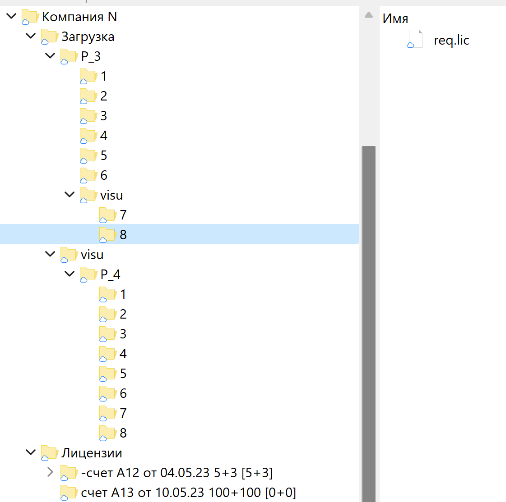
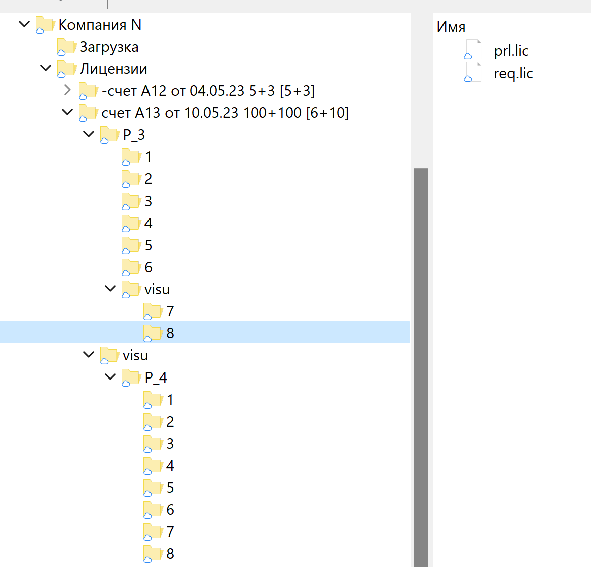

## Описание программного обеспечения

Рантайм CODESYS представляет собой набор конфигурационных, лицензионных и исполняемых файлов. Для демонстрации работы рантайм поставляется без лицензионных файлов. Рантайм без лицензионных файлов запускается в демонстрационном режиме и работает ограниченное время около 2х часов. При добавлении лицензионных файлов, рантайм запускается без ограничения по времени. Лицензионных файлов в рантайме два. Один общий для всей серии называется 3S.dat, второй называется prg.lic индивидуальный для каждого ПЛК и генерируется для каждого ПЛК отдельно. Генерация prg.lic происходит на основе данных файла запроса req.lic, который создается автоматически на ПЛК при запуске рантайма в демо режиме (без файла prg.lic). Файл запроса на для каждого ПЛК индивидуальный. Файл запроса req.lic отправляется в компанию ПроЛог. Пролог на основе req.lic генерирует лицензионный файл и возвращает индивидуальный для ПЛК prg.lic. Файл лицензии укладывается рядом с исполнительным файлом рантайма. Файл лицензии считывается при запуске рантайма. Если лицензия соответствует информации файла запроса, то рантайм запускается в рабочем режиме.

## Принцип лицензирования

С целью автоматизации генерирования лицензий был разработан нижеописанный принцип обмена лицензиями. Для клиента создается две папки на Яндекс диске. Папка «Лицензии» содержит лицензии, разбитые по счетам. Каждый счет представляет собой отдельную папку с названием вида 'имя счета v1+v2 [v3+v4]' например: 'счет А12 от 04.05.23 5+10 [0+0]'
Цифра v1 показывает количество оплаченных лицензий без визу.
Цифра v2 показывает количество оплаченных лицензий с визу.
Цифры v3 и v4 показывают количество поставленных лицензий соответственно без и с визуализацией. 

Изначально количество отгруженных лицензий устанавливается [0+0]. По мере поставки лицензий скрипт-автомат сам меняет эти значения по мере генерирования лицензий. По достижению количества поставленных лицензий значениям оплаченных лицензий название папки-счета помечается знаком минус первым символом.
При обработке **игнорируется любой элемент помеченный знаком минус перед названием** папки или файла. Разделение запросов на лицензии без визуализации и на лицензии с визуализацией происходит по анализу пути до файла запроса. Если в пути присутствует папка с названием **visu**, то запрос принимается как запрос на лицензию с визуализацией.

## Алгоритм действий:
1.	После оплаты счета, создается (сотрудником ПроЛога) папка с именем счета и указанием оплаченных лицензий по принципу, описанному выше.
1.	Клиенту высылается (если ранее не высылалась) ссылка на папку “Загрузки” с полным доступом и ссылка на папку “Лицензии” с доступом только для чтения.
1.	Клиент подготавливает папку с файлами запросов с любой ему удобной структурой каталогов, а также с любым ему удобным названиями. Следует учитывать: 
	1.	Все запросы в каталоге с именем visu, включая вложенные каталоги,  будут считаться запросами лицензий с визуализацией.
	1.	ВАЖНО! До полной загрузки запросов на Яндекс диск название коренной выгружаемой папки должно начинаться со знака минус. Это исключит обработку не полностью загруженного каталога, если запуск автомата произойдет во время загрузки.
1.	После окончания выгрузки на Яндекс диск переименовать коренную папку убрав первый символ знак минус. Это включит папку в следующий цикл обработки. 
1.	Автомат раз в два часа проверяет наличие запросов от клиента. При наличии запросов автомат проверяет свободные счета, по которым возможна поставка. Если счетов нет, то запрос исключается пометкой перед названием “-no_order_” и больше не обрабатывается.
При наличии счетов для поставки, в папке этих счетов создается структура каталогов такая же как клиент выложил в “Загрузки”, копируются файлы запросов и рядом с каждым файлом запроса создается файл лицензии с тем же названием как у файла запроса с добавлением приставки “prg_”. Следует обратить внимание, что на ПЛК файл лицензии и для визу и без называется строго prg.lic.
1.	Клиент считывает файлы лицензий согласно своей структуре.
Следует обратить внимание, что на ПЛК файл лицензии и для визу и без называется одинаково и строго prg.lic. Структура каталогов и авторские названия файлов запроса сохраняются для удобства систематизирования. Если Автомат встречает название по умолчанию req.lic, созданное рантаймом, то создает по умолчанию название prg.lic.

Примеры:
Загрузка запросов лицензий до обработки автомата показан на рис 1.

Рис 1

В примере на Рис 1 показаны два счета. Счет А12 выписан на 5 лицензий без визуализации и 3 с визуализацией. Все лицензии по этому счету были поставлены. Это видно из информации в квадратных скобках. Поэтому этот счет автомат ранее пометил знаком минус в названии и больше его не рассматривает. 
Второй счет А13 по 100 лицензий каждого вида пустой. По нему не выгружалось ни одной лицензии видно из названия [0+0]. Поэтому автомат разместит в этот счет лицензии по запросам из папки Загрузки.
В папку Загрузки клиент выгрузил два набора запросов P_3 и P_4. При этом P_4 весь с запросами с визуализацией т.к. вся папка P_4 находиться в папке visu. В наборе P_3 только лицензии 7 и 8 будут с визуализацией.
По завершению обработки всех файлов автомат удаляет обработанные файлы и пустые папки.

Результат работы автомата показан на Рис 2. 

Рис 2.
По завершению процесса автомата все запросы перенесены в свободный счет с сохранением структуры каталогов. Рядом с каждым файлом запроса лежит файл лицензии.
Перенос папки при обработке происходит не одним процессом смены расположения, а копированием и последующим удалением только тех вложенных каталогов, которые содержат файлы запроса лицензий. После переноса удаляются только пустые каталоги. Таким образом, если запрос лицензии не был обработан по какой-либо причине, то каталог и файл запроса остаются в папке *Загрузка*. 

Причины не обработки запроса могут быть разные. В случае технических причин, например прерывание связи Автомата с Яндекс диском, файлы запроса остаются в неизменном виде. В следующем сеансе работы автомата они будут обработаны. В случае организационных причин, например файлов запроса больше, чем свободных мест в счете, файлы запроса переименовываются добавлением приставки к имени “-no_order”. Это исключает его из последующих обработок и поясняет причину.
